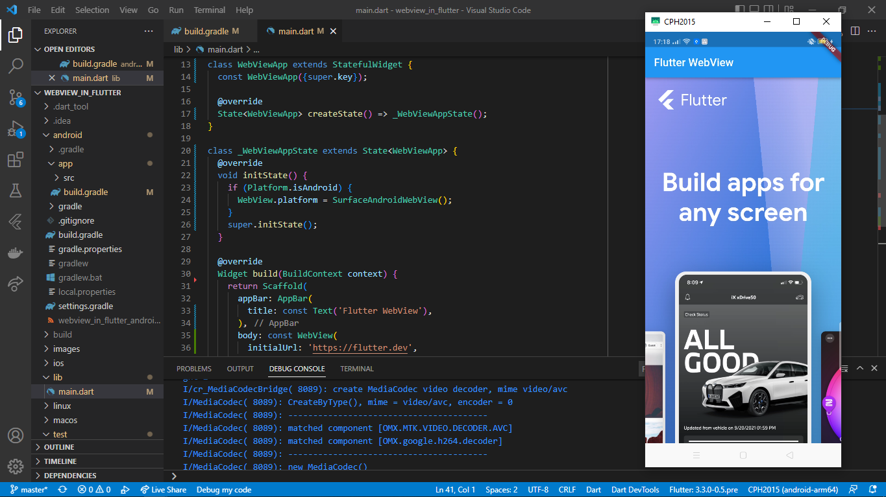
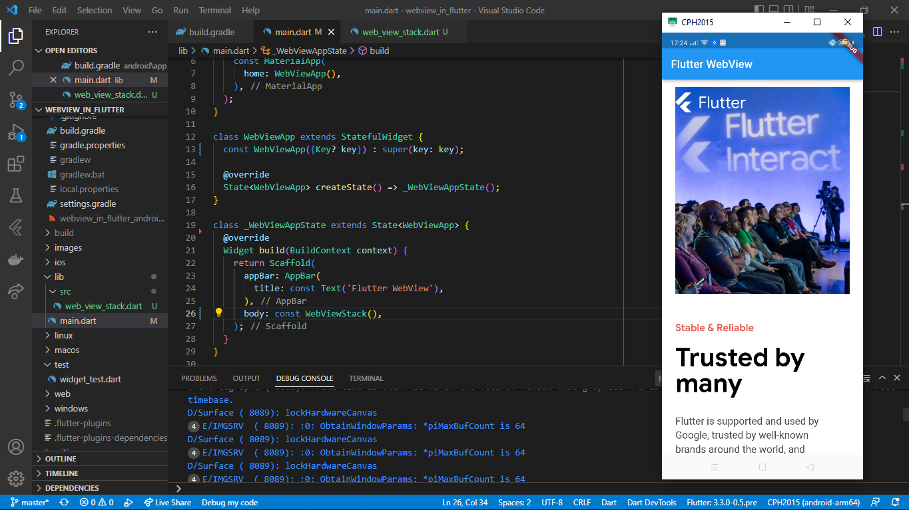
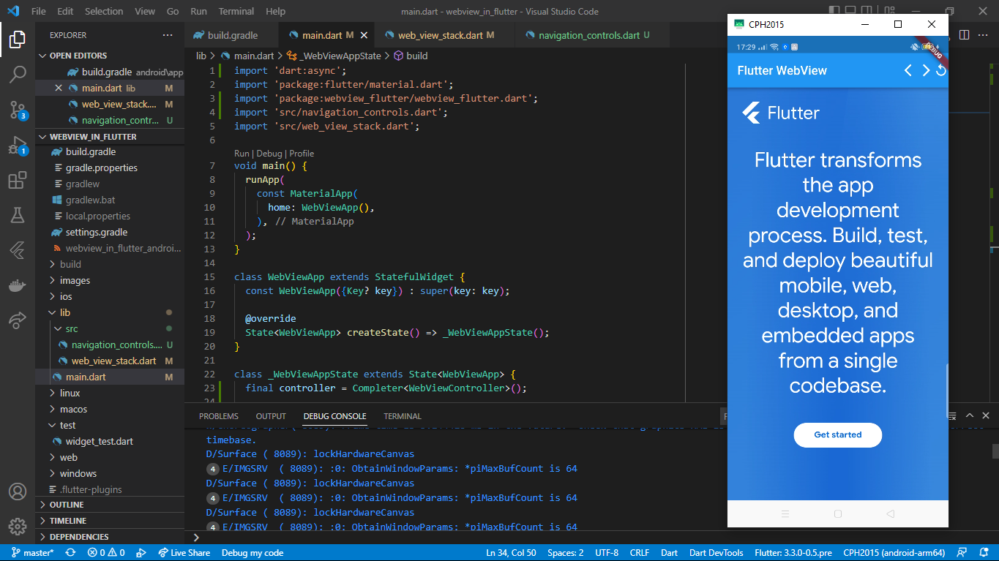
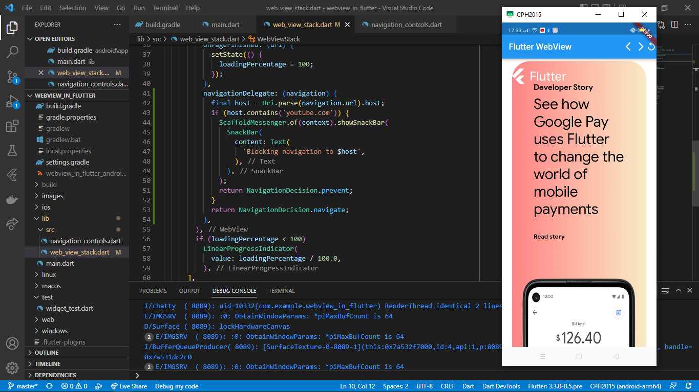
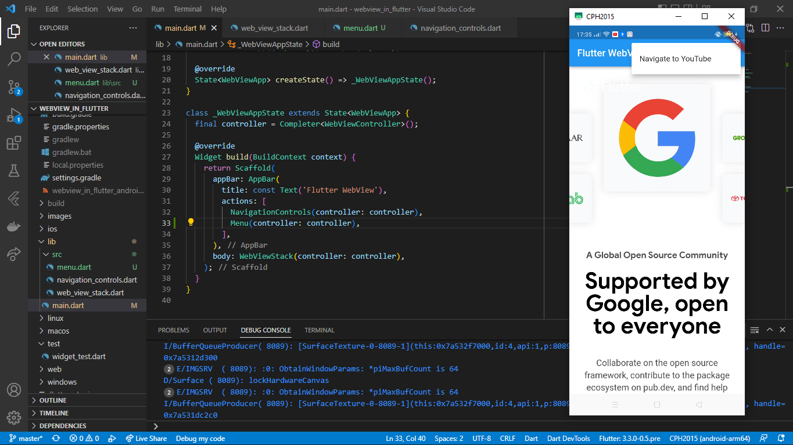
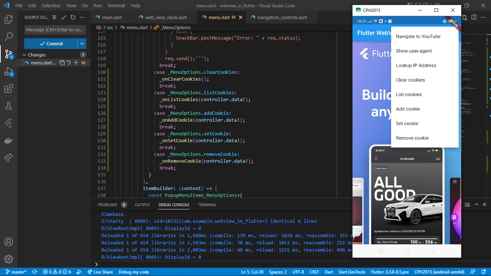
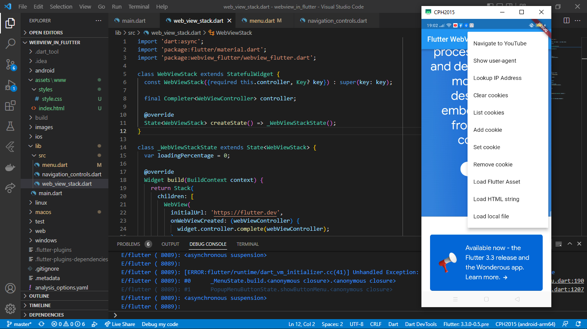

# Adding WebView to your Flutter app

### Adding WebView widget to the Flutter App

### Listening for page load events

### Working with the WebViewController

### Keeping track of navigation with the NavigationDelegate

### Adding a menu button to the AppBar

### Evaluating JavaScript

### Working with JavaScript Channels

### Managing Cookies

### Load Flutter assets, files and HTML strings in the WebView
